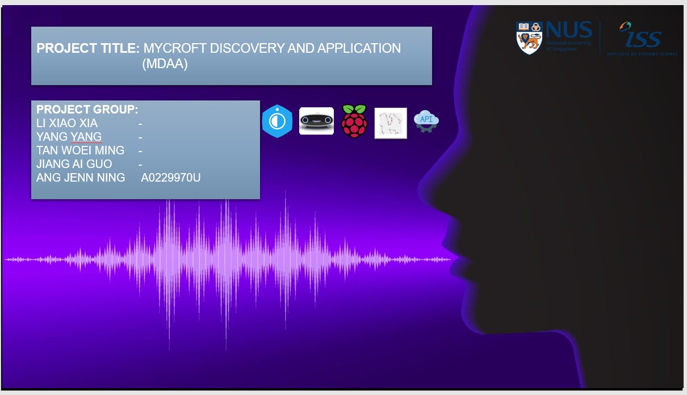


---

## SECTION 1 : PROJECT TITLE
## MyCroft Discovery and Applications

---

## SECTION 2 : EXECUTIVE SUMMARY / PAPER ABSTRACT

This project is to discover the data privacy handling, architecture, main components of Mycroft, interactions of components to make functionality and experiments on software and hardware tools for it. Main components are Wake Word Detection, Speech To Text (STT), Intent Parser, Text To Speech (TTS), Middleware (Mycroft core, home and API) and Skills. By setting up Mycroft core in specific devices and platforms followed by skill actioning, it brings all components together to fulfill the working functionality and expected experiments of Mycroft and can be treated as infrastructure for future exploration and usage.

Furthermore, our project builds a few skills which run for intended scenarios. One scenario is to have users operate (like download, run, uninstall) on skills created by the author. And another scenario is to provide voice assistants on smart delivery path optimization. These developed skills run in our built-up infrastructure.

The bright spot of the project is to document the standard setup along with getting started instructions will speed new developer onboarding and reduce developer support needs. In addition, our project is built-in few devices and platforms such as Linux VM, Picroft and setting-up personal server which provide a wide range of knowledge points of Mycroft.
The Mycroft Linux VDM platform serves as a good and standard platform for learning and exploration of Mycroft, and is suitable for most use cases. The Mycroft Picroft platform together with the Raspberry Pi device, works perfect for business cases like voice assistant for routes optimized parcel delivery, due to its small footprint and low cost. The Mycroft Personal Server, which the team spends great efforts to set up, allows users with privacy concerns or unreliable internet the ability to use Mycroft.

---

## SECTION 3 : CREDITS / PROJECT CONTRIBUTION

| Name  | Student ID  | Work Items (Who Did What) | Email |
| :------------ |:---------------:| :-----| :-----|
| LI XIAO XIA   | A0229975J | Overall system architect and design, Mycroft Linux application, Project management and documentation.| E0687383@u.nus.edu |
| YANG YANG     | A0229971R | Overall system design and implementation, Personal server setup , application and documentation.| E0687379@u.nus.edu |
| TAN WOEI MING | A0229974L | Overall system architect, design and implementation, Picroft application and documentation.| E0687382@u.nus.edu |
| JIANG AI GUO  | A0180524L | Voice assistant for routes optimized parcel delivery design, implementation and documentation.Iris species prediction application as a demo application for yangyang to build ISS Project API and Mycroft Skill| E0284010@u.nus.edu |
| ANG JENN NING | A0229970U | Overall system implementation,promotional video, system presentational video| E0687378@u.nus.edu |

---

## SECTION 4 : VIDEO OF SYSTEM MODELLING & USE CASE DEMO

MyCroft in Picroft
- Voice Assisted
- API call integration
- Private and Scalable Selene Server

---

## SECTION 5 : USER GUIDE

`Refer to MDDS_User_Guide file.`

### [ 1 ] To run the system using iss-vm

> download pre-built virtual machine from http://bit.ly/iss-vm

> start iss-vm

> open terminal in iss-vm

> $ git clone https://github.com/telescopeuser/Workshop-Project-Submission-Template.git

> $ source activate iss-env-py2

> (iss-env-py2) $ cd Workshop-Project-Submission-Template/SystemCode/clips

> (iss-env-py2) $ python app.py

> **Go to URL using web browser** http://0.0.0.0:5000 or http://127.0.0.1:5000

### [ 2 ] To run the system in other/local machine:
### Install additional necessary libraries. This application works in python 2 only.

> $ sudo apt-get install python-clips clips build-essential libssl-dev libffi-dev python-dev python-pip

> $ pip install pyclips flask flask-socketio eventlet simplejson pandas

---
## SECTION 6 : PROJECT REPORT

1. Project Overview
2. Business Perspective
3. Market Research
4. Project Objectives
5. System Specification
- Mycroft Architecture
- Mycroft Data Privacy Handling
- Mycroft Home-UI Setting
- Mycroft Linux Installation and Application
- Picroft Installation and Application
- Mycroft Personal Selene Server setup
- Mycroft Skill Management
- Use Cases Specification
6. System Implementation
- Mycroft Home Setup
- Mycroft Linux Installation and Configuration
- Mycroft Picroft Config
- Private Skill Create and Run
- Public Skill Create and Run
- Mycroft Personal Server setup
- Use Cases Implementation
7.  Project Conclusions
8. Appendix
- Project Proposal
- Mapped System Functionalities against MR, RS, CGS	35
- Installation and User Guide
- References

---
## SECTION 7 : MISCELLANEOUS

NUSCroft Demo:

---

**This [Machine Reasoning (MR)](https://www.iss.nus.edu.sg/executive-education/course/detail/machine-reasoning "Machine Reasoning") course is part of the Analytics and Intelligent Systems and Graduate Certificate in [Intelligent Reasoning Systems (IRS)](https://www.iss.nus.edu.sg/stackable-certificate-programmes/intelligent-systems "Intelligent Reasoning Systems") series offered by [NUS-ISS](https://www.iss.nus.edu.sg "Institute of Systems Science, National University of Singapore").**

**Lecturer: [GU Zhan (Sam)](https://www.iss.nus.edu.sg/about-us/staff/detail/201/GU%20Zhan "GU Zhan (Sam)")**

**zhan.gu@nus.edu.sg**
